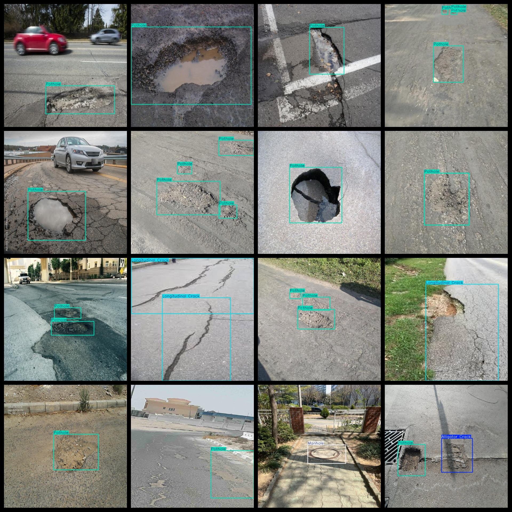
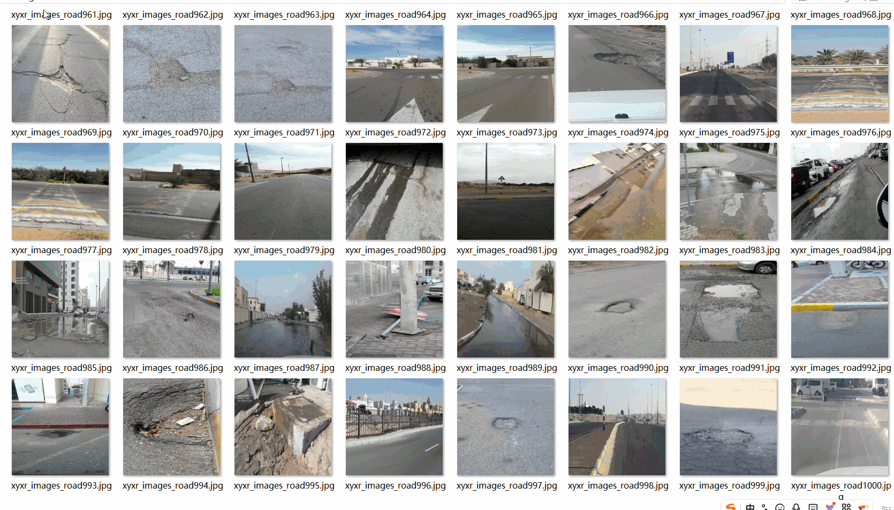

# Road Defect Detection Dataset (Crack Pothole)
5503 images in VOC+YOLO format

The dataset format includes both the VOC format and YOLO format.

The compression package contains three folders, each storing images, xml files, and txt files.

In the JPEGImages folder, there are a total of 5503 jpg images.

In the Annotations folder, there are a total of 5503 xml files.

In the labels folder, there are a total of 5503 txt files.

There are a total of 4 types of labels: ["Alligator Crack", "Longitudinal Crack", "Manhole", "Pothole"].

Each label has a corresponding number of boxes (please note that the order of categories in the YOLO format may not match this, but it is based on the classes.txt file in the labels folder).

- For the Alligator Crack label, there are 272 boxes.
- For the Longitudinal Crack label, there are 2598 boxes.
- For the Manhole label, there are 730 boxes.
- For the Pothole label, there are 7336 boxes.

Total box count: 10936

The image quality is clear with a resolution of pixels.

The images have been enhanced.

The labels are rectangular boxes used for object detection recognition.

Important Note: No guarantees are made regarding the accuracy or weights of the trained models. The dataset only provides accurate and reasonable annotations.

Special Declaration: This dataset does not guarantee any accuracy or precision of the trained model or weight files. The dataset only provides accurate and reasonable annotations.

## Images

---

Here is a pay link on Stripe (https://buy.stripe.com/3cs8yP7sY87d0vu9AB). Please contact me lonlonago@foxmail.com after funding $89, and I will send you a complete data files, thank you!

